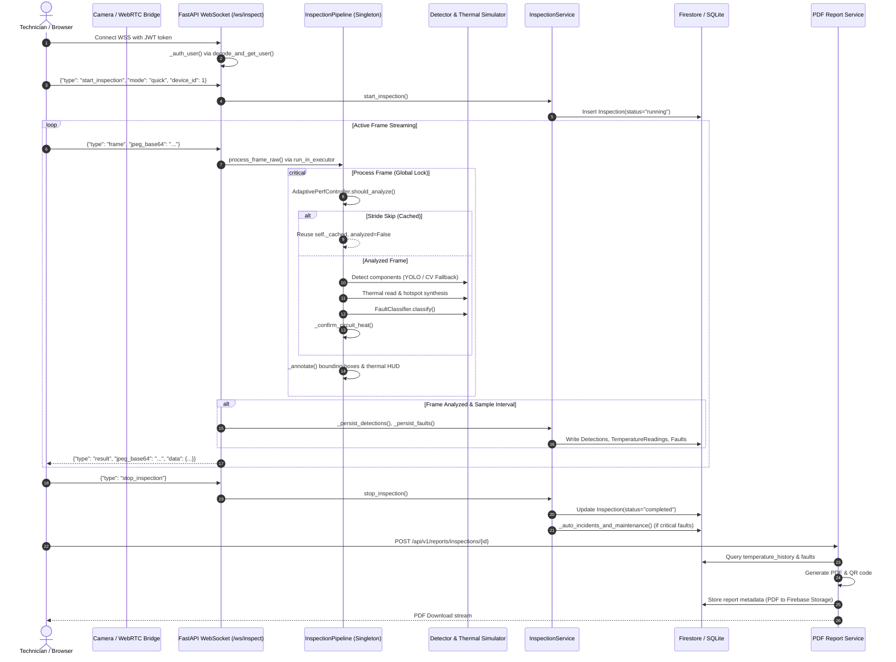
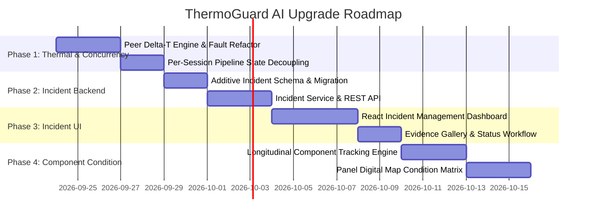

# ThermoGuard AI — Comprehensive System Audit & Upgrade Specification

**Date:** 2026-09-23  
**Auditor:** Lead Systems & AI Engineer  
**Repository:** `ThermoGuardAI`  
**Baseline Test Status:** 275 passed (91.06s), 151 warnings, 2 Ruff formatting/lint findings, 0 TypeScript/Vite build errors.

---

## 1. Executive Summary

ThermoGuard AI is designed as an industrial electrical inspection-assistance platform combining visible-light detection (YOLO/OpenCV), thermal sensor integration, predictive analytics, and evidence-backed maintenance workflows.

While the repository contains an impressive foundation—including a working FastAPI backend, dual frontends (React SPA and Streamlit), dual persistence paths (SQLite development and Cloud Firestore/Firebase Storage production), and adaptive frame processing—a rigorous code-level audit reveals **significant gaps between README claims and actual operational implementation**, as well as **critical architectural risks** around thermal honesty, global state concurrency, and incident lifecycle management.

### Critical Audit Findings at a Glance:
1. **Global Concurrency Collapse:** The core AI pipeline ([`ai/pipeline.py:116`](file:///Users/mechingee/Desktop/ThermoGuardAI/ai/pipeline.py#L116)) and Camera Capture Manager ([`backend/services/camera_service.py:10`](file:///Users/mechingee/Desktop/ThermoGuardAI/backend/services/camera_service.py#L10)) are implemented as process-wide singletons. Multiple concurrent users or camera sessions overwrite each other's cached frames, detection temporal counters, thermal buffers, and adaptive frame rates.
2. **Equating Operating Warmth with Electrical Faults:** Normal operational Joule heating ($I^2 R$) is treated as an overheating fault. Furthermore, [`ai/fault/classifier.py:113`](file:///Users/mechingee/Desktop/ThermoGuardAI/ai/fault/classifier.py#L113) emits `Fault` records for components evaluated as `HealthStatus.HEALTHY`. The system completely lacks peer-component / 3-phase comparative $\Delta T$ criteria (NETA MTS / IEEE 515).
3. **Simulated Thermal Contamination:** When running in simulator mode, synthetic temperatures are persisted to `temperature_history` ([`backend/services/inspection_service.py:344`](file:///Users/mechingee/Desktop/ThermoGuardAI/backend/services/inspection_service.py#L344)) without a `simulated` flag. The predictive maintenance engine subsequently ingests these simulated readings and produces RUL / failure probabilities presented as real equipment analytics.
4. **Unvalidated Predictive Math:** Remaining Useful Life ([`ai/predictive/rul.py:9`](file:///Users/mechingee/Desktop/ThermoGuardAI/ai/predictive/rul.py#L9)) relies on a hardcoded assumption of 6.0 operating hours per inspection and an uncalibrated logistic sigmoid function with arbitrary heuristic constants.
5. **Incomplete Incident Lifecycle & Missing UI:** The `Incident` model has no `status` lifecycle column. There is no dedicated `/api/v1/incidents` API router, and no incident management interface in the React dashboard.
6. **Authentication Mismatch on Camera Streams:** [`backend/api/v1/cameras.py:43`](file:///Users/mechingee/Desktop/ThermoGuardAI/backend/api/v1/cameras.py#L43) casts the JWT `sub` claim to `int(payload["sub"])`, which crashes with `ValueError` for all string Firebase UIDs, breaking live camera feeds in production Firebase mode.

---

## 2. End-to-End System Flow Trace

The operational data flow was verified through static tracing and active test execution:



### Detailed Ingress & Processing Steps:
1. **Camera Ingress:**
   - **Local Webcams:** `camera/capture_manager.py` captures frames continuously on a daemon thread at target FPS (default 60) into a bounded `deque(maxlen=15)` in `camera/frame_buffer.py`.
   - **Browser/Phone Client:** `frontend/react/src/pages/LiveInspection.tsx` draws getUserMedia video to canvas at 720p/1080p, compresses to JPEG (`toDataURL("image/jpeg", 0.72)`), and streams base64 payloads over `/ws/inspect`.
   - **HTTP Upload:** `POST /api/v1/inspections/{id}/frame` accepts multipart image files and decodes via `cv2.imdecode`.
2. **Transport & Authentication:**
   - Handled in `backend/api/v1/ws.py`. Authentication is validated before accepting the WebSocket handshake via `_auth_user(token)` using `decode_and_get_user()`.
   - The token is checked against local JWT secret or Firebase Auth (depending on `AUTH_BACKEND`).
3. **Inference & Thermal Execution:**
   - Handled by `ai/pipeline.py:InspectionPipeline`.
   - `_preprocess()` enforces uint8 BGR.
   - `AdaptivePerfController` adjusts scale ($0.35\times$ to $1.0\times$) and stride ($1$ to $8$).
   - On analyzed frames:
     - `ai/detector/yolo_detector.py` or `ai/detector/fallback.py` outputs bounding boxes.
     - `ai/thermal/factory.py:get_thermal_source()` provides the thermal frame. If no hardware is detected, `ai/thermal/simulator.py:ThermalSimulator` synthesizes thermal readings.
     - `ai/fault/classifier.py:FaultClassifier` evaluates thermal rise against ambient and runs visual defect heuristics (`ai/visual/fault_heuristics.py`).
4. **Persistence:**
   - `backend/services/inspection_service.py` persists detections and faults every 10 analyzed frames (`DETECTION_SAMPLE_EVERY = 10`).
   - Writes to SQLite via SQLAlchemy ORM or to Cloud Firestore via `FirestoreSession` shim ([`backend/firebase/engine.py`](file:///Users/mechingee/Desktop/ThermoGuardAI/backend/firebase/engine.py)).
5. **Alarms:**
   - `backend/services/alarm_service.py` creates `Alarm` records with a 30s cooldown per fault key.
   - A buzzer sound is flagged only for `overloaded_circuit`.
6. **Reporting:**
   - `reports/pdf_generator.py` uses ReportLab to compile multi-page PDF documents embedding raw, annotated, and thermal frames. In Firestore mode, PDFs upload to Firebase Storage and local temp files are deleted.

---

## 3. README Capability Verification Matrix

| Capability Claimed in README | Implementation Status | Evidence (File Paths & Symbols) | Reality vs. Claim |
|---|---|---|---|
| **Real-time detection pipeline (YOLOv11 + CV fallback)** | **Partially Implemented** | [`ai/detector/yolo_detector.py:14`](file:///Users/mechingee/Desktop/ThermoGuardAI/ai/detector/yolo_detector.py#L14)<br>[`ai/detector/fallback.py:17`](file:///Users/mechingee/Desktop/ThermoGuardAI/ai/detector/fallback.py#L17) | Fallback detector works well. However, bundled `models/electrical_yolo.pt` is an exact copy of COCO `yolo11n.pt` (5.6MB). The loader correctly rejects it via `is_electrical_model()` unless `ALLOW_GENERIC_MODEL=true`. Without user training, it always runs on CV fallback. |
| **RGB-only inspection mode (burn, sparks, smoke, corrosion...)** | **Partially Implemented** | [`ai/visual/fault_heuristics.py:38`](file:///Users/mechingee/Desktop/ThermoGuardAI/ai/visual/fault_heuristics.py#L38) | Detects burn marks, sparks, smoke, water intrusion, discoloration, and loose wires via OpenCV. **Corrosion heuristic is absent**. In standard webcam runs, `THERMAL_MODE=auto` falls back to the simulator and overlays fake heat rather than staying purely RGB. |
| **Thermal analysis + simulator** | **Implemented** | [`ai/thermal/processing.py:79`](file:///Users/mechingee/Desktop/ThermoGuardAI/ai/thermal/processing.py#L79)<br>[`ai/thermal/simulator.py:18`](file:///Users/mechingee/Desktop/ThermoGuardAI/ai/thermal/simulator.py#L18) | Comprehensive spatial statistics, colormap generation, and multi-region circuit heat analysis. Simulator is deterministic and clearly marked. |
| **Mobile phone camera via browser (WebRTC / getUserMedia / WebSocket)** | **Partially Implemented** (Misrepresented) | [`camera/sources/phone.py:21`](file:///Users/mechingee/Desktop/ThermoGuardAI/camera/sources/phone.py#L21)<br>[`frontend/mobile/index.html:1`](file:///Users/mechingee/Desktop/ThermoGuardAI/frontend/mobile/index.html#L1) | **WebRTC is not implemented**. The client uses standard HTML5 `getUserMedia()` and streams JPEG snapshots over WebSocket. |
| **Fault severity: Healthy / Warning / High / Critical** | **Implemented** (Flawed logic) | [`ai/fault/rules.py:39`](file:///Users/mechingee/Desktop/ThermoGuardAI/ai/fault/rules.py#L39)<br>[`ai/fault/classifier.py:106`](file:///Users/mechingee/Desktop/ThermoGuardAI/ai/fault/classifier.py#L106) | Thresholds exist per component. However, healthy components are erroneously emitted as `Fault` objects with `severity="healthy"`. |
| **Intelligent alarms (sound, flashing frame, evidence, webhook)** | **Implemented** | [`backend/services/alarm_service.py:33`](file:///Users/mechingee/Desktop/ThermoGuardAI/backend/services/alarm_service.py#L33)<br>[`ai/pipeline.py:540`](file:///Users/mechingee/Desktop/ThermoGuardAI/ai/pipeline.py#L540) | Database logging, evidence frame persistence, audio trigger flag, and flashing border in annotations are all functional. |
| **Predictive maintenance (trends, RUL, failure probability)** | **Simulated / Unvalidated** | [`ai/predictive/rul.py:9`](file:///Users/mechingee/Desktop/ThermoGuardAI/ai/predictive/rul.py#L9)<br>[`ai/predictive/rul.py:33`](file:///Users/mechingee/Desktop/ThermoGuardAI/ai/predictive/rul.py#L33) | Hardcoded assumptions (6 operating hours per inspection). Logistic failure probability is an uncalibrated heuristic. Ingests simulated temperatures as real data. |
| **Professional PDF reports (logo, tables, QR, signature)** | **Implemented** | [`reports/pdf_generator.py:73`](file:///Users/mechingee/Desktop/ThermoGuardAI/reports/pdf_generator.py#L73)<br>[`backend/services/report_service.py:33`](file:///Users/mechingee/Desktop/ThermoGuardAI/backend/services/report_service.py#L33) | Robust ReportLab implementation with charts, tables, QR verification links, and Firebase Storage persistence in production. |
| **Digital panel mapping (stable component IDs)** | **Partially Implemented** | [`backend/models/component.py:20`](file:///Users/mechingee/Desktop/ThermoGuardAI/backend/models/component.py#L20)<br>[`backend/services/inspection_service.py:510`](file:///Users/mechingee/Desktop/ThermoGuardAI/backend/services/inspection_service.py#L510) | Stable codes (`B1`, `R1`) and normalized coordinates exist in schema. However, runtime matching is a simple label upsert; no interactive mapping UI exists. |
| **JWT auth + RBAC (admin / technician / viewer)** | **Implemented** | [`backend/api/deps.py:23`](file:///Users/mechingee/Desktop/ThermoGuardAI/backend/api/deps.py#L23)<br>[`backend/core/security.py:40`](file:///Users/mechingee/Desktop/ThermoGuardAI/backend/core/security.py#L40) | Full support for local JWT and Firebase Authentication with organization scoping and role enforcement. |
| **Streamlit dashboard AND React dashboard** | **Implemented** | [`frontend/react/src/App.tsx:23`](file:///Users/mechingee/Desktop/ThermoGuardAI/frontend/react/src/App.tsx#L23)<br>[`frontend/streamlit/`](file:///Users/mechingee/Desktop/ThermoGuardAI/frontend/streamlit/) | Both dashboards run and render. React frontend compiles cleanly under Vite. |
| **Training pipeline (synthetic dataset → YOLO → ONNX)** | **Partially Implemented** | [`training/dataset_gen.py:1`](file:///Users/mechingee/Desktop/ThermoGuardAI/training/dataset_gen.py#L1)<br>[`training/train_yolo.py:1`](file:///Users/mechingee/Desktop/ThermoGuardAI/training/train_yolo.py#L1) | Scripts exist and work synthetically. However, no trained domain weights are included in the repository. |
| **Docker / Docker Compose deployment** | **Implemented** | [`docker/docker-compose.yml:1`](file:///Users/mechingee/Desktop/ThermoGuardAI/docker/docker-compose.yml#L1) | Production multi-container setup configured for Firebase without PostgreSQL/SQLite. |
| **Unit + integration tests** | **Implemented** | [`tests/`](file:///Users/mechingee/Desktop/ThermoGuardAI/tests/) | 275 passing tests covering security, models, repositories, and API endpoints. |
| **Hardware Thermal Drivers (MLX90640, Lepton, AMG8833, Seek)** | **Stubbed / Adapter Ready** | [`ai/thermal/drivers.py:19`](file:///Users/mechingee/Desktop/ThermoGuardAI/ai/thermal/drivers.py#L19) | Proper hardware driver wrappers, but stubbed to catch import errors when physical buses (I2C/SPI) are missing. |

---

## 4. Deep-Dive Security & Integrity Analysis

### 4.1 Production Accidentally Using SQLite or Local Authentication
* **Code Verification:** [`backend/core/config.py:205-242`](file:///Users/mechingee/Desktop/ThermoGuardAI/backend/core/config.py#L205-L242), [`backend/db/session.py:255-288`](file:///Users/mechingee/Desktop/ThermoGuardAI/backend/db/session.py#L255-L288).
* **Observed Mechanism:** In `backend/core/config.py:Settings.validate_security()`, when `APP_ENV=production`, the application aborts startup if `auth_backend != "firebase"` or `storage_backend != "firestore"`. In `backend/db/session.py`, calling `_get_engine()` or `SessionLocal()` throws a loud `RuntimeError` if `storage_uses_firestore` is True.
* **Risk Identified:** If an operator deploys without setting `APP_ENV=production`, the system defaults to `app_env="development"`, `auth_backend="local"`, and `storage_backend="sqlite"`, silently writing to `database/thermoguard.db`.
* **Remediation:** Enforce that missing `APP_ENV` fails closed if deployed in container environments (e.g. check for `/.dockerenv`).

### 4.2 Simulated Temperature Presented as Real
* **Code Verification:** [`backend/models/temperature_history.py:16-32`](file:///Users/mechingee/Desktop/ThermoGuardAI/backend/models/temperature_history.py#L16-L32), [`backend/services/inspection_service.py:344-353`](file:///Users/mechingee/Desktop/ThermoGuardAI/backend/services/inspection_service.py#L344-L353), [`backend/services/asset_service.py:53-79`](file:///Users/mechingee/Desktop/ThermoGuardAI/backend/services/asset_service.py#L53-L79).
* **Observed Mechanism:**
  - `ThermalHistory` (top-level device readings) has a `simulated: bool` column and is properly filtered by `DeviceAnalyticsService(exclude_demo=True)`.
  - **However, `TemperatureReading` (per-component readings) DOES NOT have a `simulated` column.**
  - In `InspectionService._persist_detections()`, when an inspection runs with `ThermalSimulator`, simulated temperatures are written with `source="thermal"` and no indication of simulation.
  - `AssetService._prediction_map()` queries `TemperatureReading` directly to calculate degradation, remaining useful life, and failure probability—passing simulated data into predictive analytics without disclosure.

### 4.3 RGB Images Assigned Temperature Measurements
* **Code Verification:** [`ai/visual/fault_heuristics.py:18-26`](file:///Users/mechingee/Desktop/ThermoGuardAI/ai/visual/fault_heuristics.py#L18-L26), [`ai/board/heat_risk.py:18-20`](file:///Users/mechingee/Desktop/ThermoGuardAI/ai/board/heat_risk.py#L18-L20), [`ai/pipeline.py:330-380`](file:///Users/mechingee/Desktop/ThermoGuardAI/ai/pipeline.py#L330-L380).
* **Observed Mechanism:**
  - Pure visual heuristics in `ai/visual/` and `ai/board/` correctly stamp `is_temperature=False` and `measurement="ESTIMATED_FROM_IMAGE"`.
  - **However, in `ai/pipeline.py:InspectionPipeline._thermal_for()`, when a user uses a standard webcam or mobile phone without a thermal camera (`THERMAL_MODE=auto`), the system defaults to `ThermalSimulator`.**
  - The simulator attaches synthetic hotspot temperatures (e.g. +58°C rise) directly to the detected bounding boxes from the RGB camera.
  - The annotated frame renders these as temperature readings (`XX.X°C`), giving the user the impression that their RGB camera measured component temperatures.

### 4.4 Cached Analysis Presented as Fresh
* **Code Verification:** [`ai/pipeline.py:175-228`](file:///Users/mechingee/Desktop/ThermoGuardAI/ai/pipeline.py#L175-L228), [`ai/adaptive.py:82-95`](file:///Users/mechingee/Desktop/ThermoGuardAI/ai/adaptive.py#L82-L95).
* **Observed Mechanism:**
  - When the adaptive performance controller increases stride (`stride > 1`), analysis is skipped on intermediate frames.
  - `InspectionResult` sets `analyzed=False`.
  - The frame is still annotated with bounding boxes and temperatures copied from `self._cached`.
  - While `result.to_json()` outputs `"analyzed": false`, the client UI does not visually distinguish between a freshly analyzed frame and a frame reusing cached bounding boxes and temperatures.

### 4.5 Unvalidated RUL and Failure Probability
* **Code Verification:** [`ai/predictive/rul.py:9-45`](file:///Users/mechingee/Desktop/ThermoGuardAI/ai/predictive/rul.py#L9-L45).
* **Observed Mechanism:**
  - `estimate_rul_hours()` hardcodes `operating_hours_per_inspection: float = 6.0`. It calculates `steps_to_limit = (limit_c - latest) / slope` and multiplies by 6.0. If inspections occur weekly or monthly, the RUL in hours is completely arbitrary.
  - `failure_probability()` uses an unvalidated formula:
    $$\text{probability} = \frac{1}{1 + e^{-6.0 \cdot (\text{ratio} - 0.55)}}$$
    with an arbitrary bonus `+ 0.1` if slope $> 0.3$.
  - These values are presented in the UI as probabilistic failure metrics without statistical confidence bounds or empirical calibration.

### 4.6 Global State Shared Across Cameras or Users
* **Code Verification:**
  - [`backend/services/inspection_service.py:34-54`](file:///Users/mechingee/Desktop/ThermoGuardAI/backend/services/inspection_service.py#L34-L54): Singleton `_pipeline = InspectionPipeline()`.
  - [`backend/services/camera_service.py:10-17`](file:///Users/mechingee/Desktop/ThermoGuardAI/backend/services/camera_service.py#L10-L17): Singleton `_manager = CaptureManager()`.
* **Observed Mechanism:**
  - `InspectionPipeline` maintains mutable instance state: `self._cached`, `self._last_thermal_rgb`, `self._heat_confirm` (frame counters), `self._detection_sightings`, and `self.perf` (adaptive scaling/stride).
  - Because `get_pipeline()` returns a single global instance, **multiple concurrent inspections from different users/devices share this exact state**.
  - If User A inspects Device 1 and User B inspects Device 2 simultaneously, their frames interleave. User B's frame overwrites User A's cached detections and resets User A's `_heat_confirm` consecutive frame counters.
  - Similarly, `camera_service.switch_camera()` switches the physical camera for all connected sessions.

### 4.7 WebSocket Authentication & Security
* **Code Verification:** [`backend/api/v1/ws.py:43-73`](file:///Users/mechingee/Desktop/ThermoGuardAI/backend/api/v1/ws.py#L43-L73), [`backend/api/v1/cameras.py:37-46`](file:///Users/mechingee/Desktop/ThermoGuardAI/backend/api/v1/cameras.py#L37-L46).
* **Observed Mechanism:**
  - `/ws/inspect` correctly enforces authentication before `websocket.accept()`. If `?token=` is missing or invalid, it closes with code 4401.
  - `test_s4_ws_security.py` thoroughly verifies that cross-organization device injection is prevented over WebSocket.
  - **Defect Found in Camera Stream Auth:** In [`backend/api/v1/cameras.py:43`](file:///Users/mechingee/Desktop/ThermoGuardAI/backend/api/v1/cameras.py#L43):
    ```python
    payload = decode_access_token(token)
    return int(payload["sub"])
    ```
    In Firebase Auth mode, `payload["sub"]` is an alphanumeric Firebase UID string (e.g., `"vK93jD..."`). Calling `int(...)` raises `ValueError`, resulting in a 401 Unauthorized for valid Firebase users accessing camera streams.

### 4.8 Unbounded Frame Queues & Backpressure
* **Code Verification:** [`backend/api/v1/ws.py:82-83, 217`](file:///Users/mechingee/Desktop/ThermoGuardAI/backend/api/v1/ws.py#L82-L83), [`camera/frame_buffer.py:14-20`](file:///Users/mechingee/Desktop/ThermoGuardAI/camera/frame_buffer.py#L14-L20).
* **Observed Mechanism:**
  - Internal camera capture buffers (`FrameBuffer`) are strictly bounded to `maxlen=30` or `maxlen=15`.
  - In `backend/api/v1/ws.py`, frames from the client are processed via `await executor(None, service.process_frame_raw, inspection_id, frame)`.
  - While `LiveInspection.tsx` implements client-side backpressure (`inFlightRef`), **the server itself has no inbound queue limit**. If an automated client or rogue script sends frames faster than inference can run, jobs accumulate in Python's unbounded `ThreadPoolExecutor` queue, leading to unbounded memory growth and latency spikes.

---

## 5. Dependency & Environment Audit

### 5.1 Python Environment & Manifests
* **Python Version:** Python 3.12.13 (recommended 3.12).
* **`requirements.txt`:** Correctly separates core server dependencies from heavy ML frameworks. Core includes `fastapi`, `uvicorn`, `sqlalchemy>=2.0.30`, `pydantic>=2.8.0`, `opencv-python`, `reportlab`, `firebase-admin>=6.0`.
* **`requirements-ai.txt`:** Contains `ultralytics>=8.3.0`, `torch>=2.2.0`, `onnxruntime>=1.18.0`, and pins `numpy<2` to prevent NumPy 2.x C-ABI incompatibilities with older PyTorch builds.
* **Linting / Formatting Status:**
  - Running `.venv/bin/ruff check .` identified 2 fixable linter errors:
    1. [`ai/board/heat_risk.py:519:1`](file:///Users/mechingee/Desktop/ThermoGuardAI/ai/board/heat_risk.py#L519): `W293` Blank line contains whitespace.
    2. [`ai/board/wire_faults.py:461:13`](file:///Users/mechingee/Desktop/ThermoGuardAI/ai/board/wire_faults.py#L461): `UP034` Extraneous parentheses.

### 5.2 Frontend Environment
* **React Stack:** React 18.3.1, TypeScript 5.5.4, Vite 5.4.0, Recharts 2.12.7, React Router 6.26.0, Firebase JS SDK 11.10.0.
* **Build Verification:** `npm run build` executed cleanly in 3.69s.
* **Asset Mounting Gap:** `backend/main.py` mounts `/media` and `/reports`, but does not mount `frontend/react/dist`. In production, the React SPA must either be served via an external web server (Nginx/Caddy) or mounted explicitly in `main.py`.

---

## 6. Architecture & Domain Model Deficiencies

### 6.1 Equating Warm Regions with Faults
- Real-world electrical equipment carrying load operates warmer than ambient ($P = I^2 R$).
- Current code evaluates temperature purely against static limits ([`ai/fault/rules.py`](file:///Users/mechingee/Desktop/ThermoGuardAI/ai/fault/rules.py)) or concentric dilation ([`ai/thermal/processing.py:79`](file:///Users/mechingee/Desktop/ThermoGuardAI/ai/thermal/processing.py#L79)).
- Crucially, it lacks **comparative $\Delta T$ criteria** between phases or peer breakers on the same panel (e.g. NETA MTS Table 100.18):
  - $\Delta T < 4^\circ\text{C}$ between peers: Normal load warming (balanced).
  - $\Delta T = 4^\circ\text{C} \text{ to } 15^\circ\text{C}$: Moderate anomaly.
  - $\Delta T > 15^\circ\text{C}$: Major critical discrepancy.

### 6.2 Missing Incident Management System
- The `incidents` table contains only 12 columns. It lacks:
  - `status` (`OPEN`, `UNDER_INVESTIGATION`, `MITIGATED`, `RESOLVED`, `FALSE_POSITIVE`, `CLOSED`).
  - Resolution audit fields (`resolved_at`, `resolved_by`, `resolution_notes`).
  - Direct relational links (`device_id`, `panel_id`, `component_id`).
  - Thermal evidence links (`evidence_thermal_path`, `delta_t`, `peer_comparison`).
- There is no `backend/api/v1/incidents.py` router. Incidents cannot be queried, filtered, or updated independently of inspections.
- There is no incident interface in the React dashboard.

---

## 7. Prioritized Upgrade Plan



### Phase 1: Trustworthy Thermal Condition & Session Concurrency Engine
* **Goal:** Eliminate false positives on normal load heating and prevent cross-session pipeline corruption.
* **Dependencies:** None.
* **Target Files:**
  - [`ai/fault/classifier.py`](file:///Users/mechingee/Desktop/ThermoGuardAI/ai/fault/classifier.py), [`ai/fault/rules.py`](file:///Users/mechingee/Desktop/ThermoGuardAI/ai/fault/rules.py), [`ai/fault/differential.py`](file:///Users/mechingee/Desktop/ThermoGuardAI/ai/fault/differential.py) (new).
  - [`ai/pipeline.py`](file:///Users/mechingee/Desktop/ThermoGuardAI/ai/pipeline.py), [`backend/services/inspection_service.py`](file:///Users/mechingee/Desktop/ThermoGuardAI/backend/services/inspection_service.py).
  - [`backend/api/v1/cameras.py`](file:///Users/mechingee/Desktop/ThermoGuardAI/backend/api/v1/cameras.py).
* **Acceptance Criteria:**
  1. Balanced 3-phase heating produces zero false overheating alarms.
  2. Components with `HealthStatus.HEALTHY` emit zero `Fault` records.
  3. `InspectionPipeline` state is isolated per inspection/session (no cross-talk between concurrent users).
  4. Camera stream endpoint accepts string Firebase UIDs without raising `ValueError`.
  5. All 275 existing tests pass, plus new differential thermal tests.

### Phase 2: Evidence-Backed Incident Management Backend
* **Goal:** Provide a full incident lifecycle with organization isolation and multi-modal evidence linking.
* **Dependencies:** Phase 1.
* **Target Files:**
  - [`backend/models/incident.py`](file:///Users/mechingee/Desktop/ThermoGuardAI/backend/models/incident.py), [`backend/db/session.py`](file:///Users/mechingee/Desktop/ThermoGuardAI/backend/db/session.py), [`backend/firebase/engine.py`](file:///Users/mechingee/Desktop/ThermoGuardAI/backend/firebase/engine.py).
  - [`backend/repositories/incident_repo.py`](file:///Users/mechingee/Desktop/ThermoGuardAI/backend/repositories/incident_repo.py) (new), [`backend/services/incident_service.py`](file:///Users/mechingee/Desktop/ThermoGuardAI/backend/services/incident_service.py) (new).
  - [`backend/services/isolation.py`](file:///Users/mechingee/Desktop/ThermoGuardAI/backend/services/isolation.py), [`backend/api/v1/incidents.py`](file:///Users/mechingee/Desktop/ThermoGuardAI/backend/api/v1/incidents.py) (new).
  - [`backend/models/temperature_history.py`](file:///Users/mechingee/Desktop/ThermoGuardAI/backend/models/temperature_history.py) (add `simulated` flag).
* **Acceptance Criteria:**
  1. Additive migrations add `status`, `device_id`, `panel_id`, `component_id`, `evidence_thermal_path`, `resolution_*` columns without dropping or migrating existing data destructively.
  2. `GET /api/v1/incidents` supports filtering by status, severity, device, and date range with organization isolation.
  3. `PATCH /api/v1/incidents/{id}` supports transitioning statuses and logging audit events.
  4. Both SQLite and Cloud Firestore persistence pass identical integration tests.

### Phase 3: Incident Management UI (React Primary & Streamlit Secondary)
* **Goal:** Deliver an intuitive incident management dashboard with multi-modal evidence inspection.
* **Dependencies:** Phase 2.
* **Target Files:**
  - [`frontend/react/src/pages/Incidents.tsx`](file:///Users/mechingee/Desktop/ThermoGuardAI/frontend/react/src/pages/Incidents.tsx) (new), [`frontend/react/src/App.tsx`](file:///Users/mechingee/Desktop/ThermoGuardAI/frontend/react/src/App.tsx), [`frontend/react/src/components/Layout.tsx`](file:///Users/mechingee/Desktop/ThermoGuardAI/frontend/react/src/components/Layout.tsx).
  - [`frontend/react/src/api/client.ts`](file:///Users/mechingee/Desktop/ThermoGuardAI/frontend/react/src/api/client.ts).
  - [`frontend/streamlit/pages/3_Inspection_History.py`](file:///Users/mechingee/Desktop/ThermoGuardAI/frontend/streamlit/pages/3_Inspection_History.py).
* **Acceptance Criteria:**
  1. New `/incidents` route rendered in React dashboard with status badges and severity filters.
  2. Evidence modal displays synchronized raw visible capture, annotated detection bounding boxes, and radiometric thermal colormap overlay.
  3. Technicians can update incident status, enter investigation notes, and link maintenance work orders.
  4. Clean Vite build with zero TypeScript errors.

### Phase 4: Longitudinal Component Condition Tracking
* **Goal:** Aggregate historical inspections into persistent component condition timelines and health matrices.
* **Dependencies:** Phase 1 and Phase 2.
* **Target Files:**
  - [`backend/services/asset_service.py`](file:///Users/mechingee/Desktop/ThermoGuardAI/backend/services/asset_service.py), [`backend/api/v1/assets.py`](file:///Users/mechingee/Desktop/ThermoGuardAI/backend/api/v1/assets.py).
  - [`frontend/react/src/pages/DeviceDetail.tsx`](file:///Users/mechingee/Desktop/ThermoGuardAI/frontend/react/src/pages/DeviceDetail.tsx), [`frontend/react/src/pages/Panels.tsx`](file:///Users/mechingee/Desktop/ThermoGuardAI/frontend/react/src/pages/Panels.tsx).
* **Acceptance Criteria:**
  1. Per-component condition history tracks operational baselines and anomaly frequency.
  2. Panel inspection view renders a condition matrix (`HEALTHY`, `MONITOR`, `ATTENTION`, `DEGRADED`, `CRITICAL`).
  3. Predictive analytics exclude simulated readings by default with explicit badge indicators.
